<div align="center">

# Cornell Craves

### Campus food fundraiser discovery. Order together. Share costs.

Cornell student clubs run food fundraisers like real storefronts: post drops, take orders, verify payments, and scan QR passes at pickup. Students discover food on a feed or campus map, order solo or split an item with friends, and get everything by email.

Built with React + Vite + Tailwind v4 + Supabase. Payments go directly to clubs over Venmo and Zelle; Cornell Craves never touches money.

</div>

---

## Student experience

| Feed | Listing | Reviews |
|---|---|---|
| 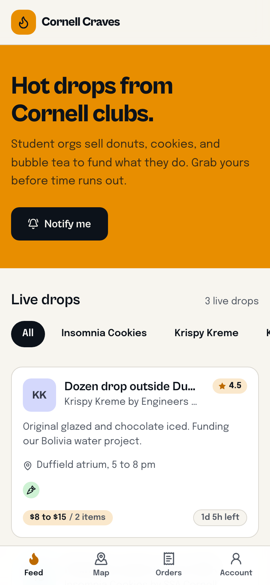 | 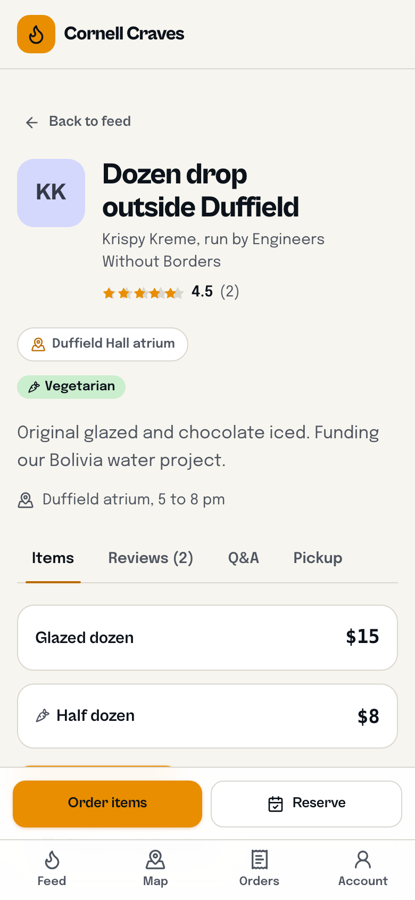 | 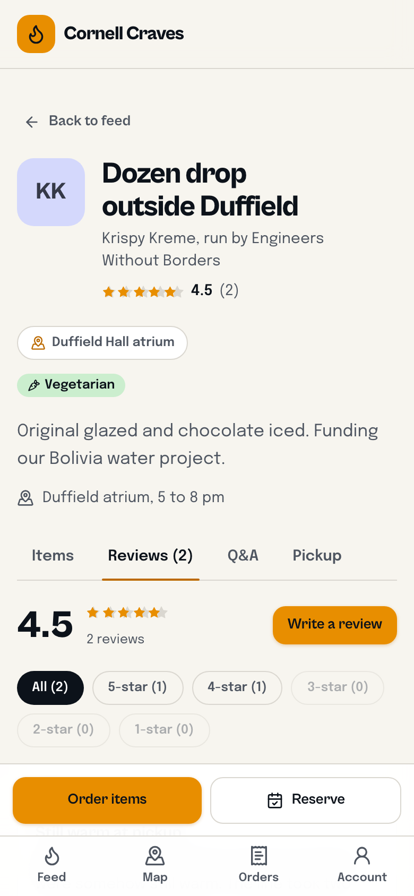 |
| Brand filter chips, live ratings, dietary icons, countdown badges. | Tabbed Items / Reviews / Q&A / Pickup with allergen icons. | Star ratings, helpful votes, club responses. |

| Q&A | Pickup scheduling | Order form |
|---|---|---|
| 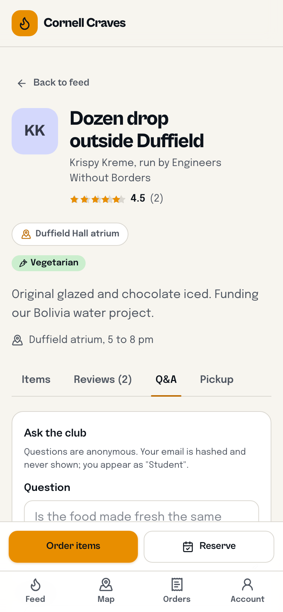 | 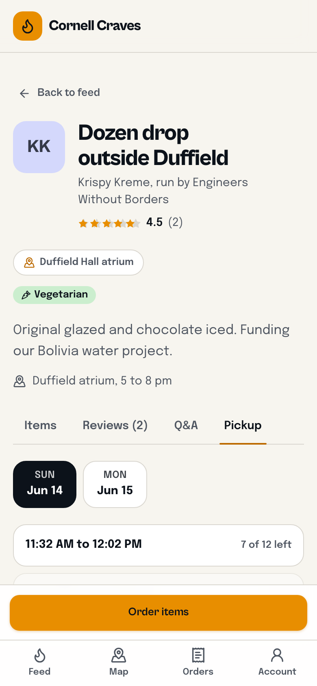 | 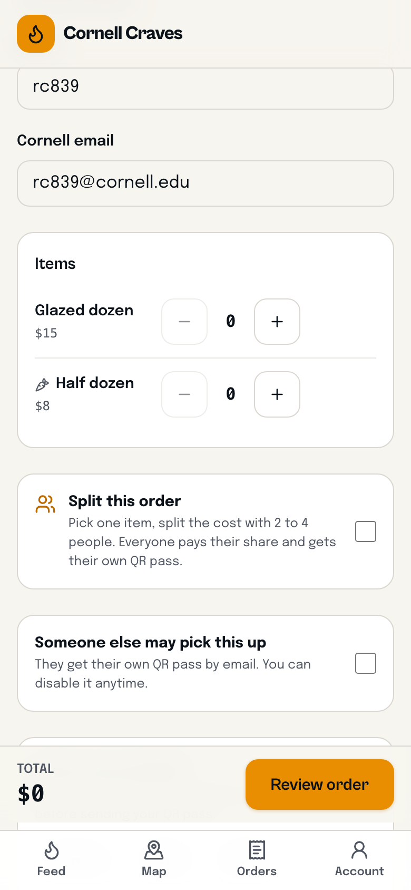 |
| Anonymous questions, public club answers. | Inline day + slot picker, capacity aware. | Quantity steppers, running total, split toggle. |

| My orders + groups | QR pickup passes | Split invite |
|---|---|---|
| 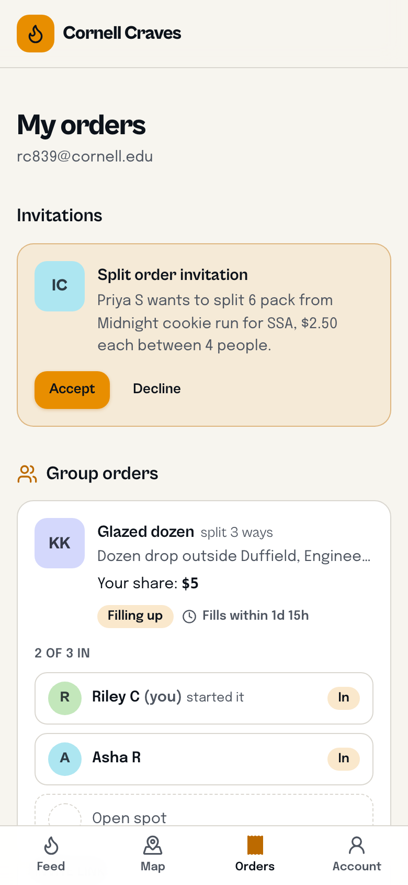 | 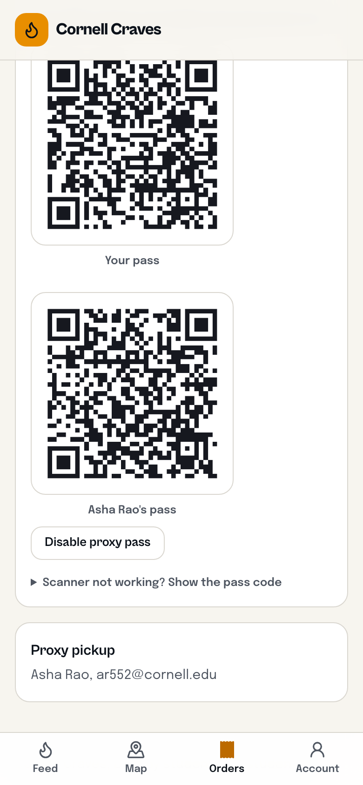 | 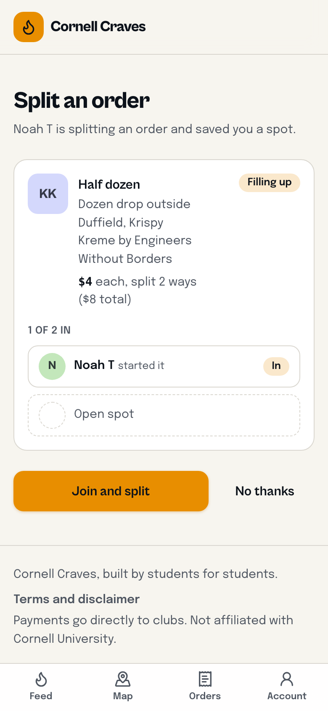 |
| Solo orders, group orders, invitations, deadline timers. | Per-person QR passes, proxy pass toggle. | Join-link page for split orders. |

| Campus map | My pickups | Account + cravings |
|---|---|---|
| 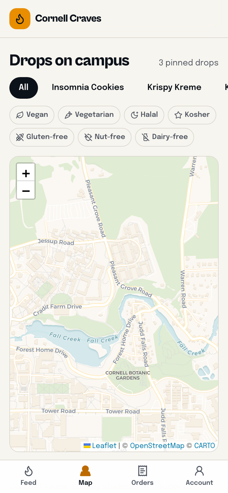 | 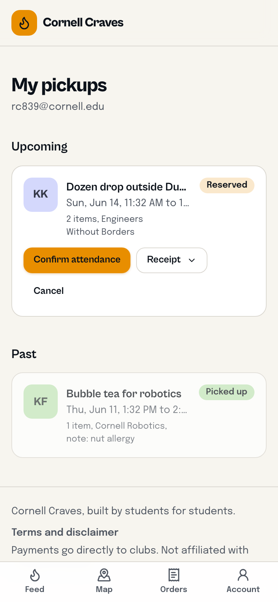 | 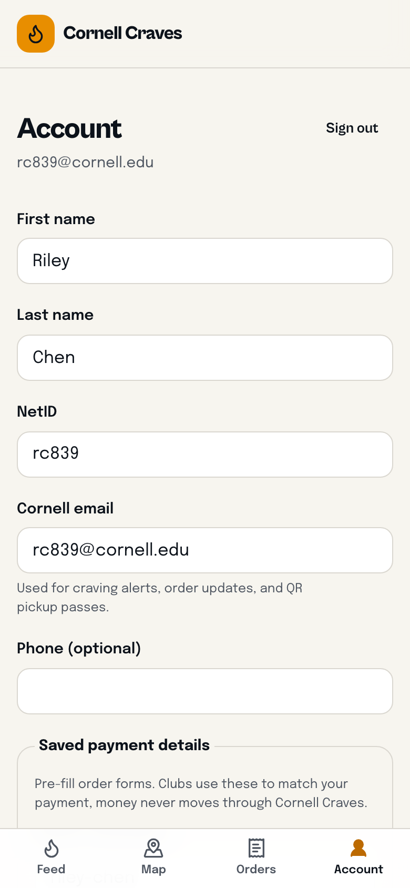 |
| Saffron pins, pickup-type badges, dietary filters. | Upcoming and past reservations, confirm attendance. | Profile, saved payment handles, brand + dietary prefs. |

## Club experience

| Sign in (Student / Club) | Club dashboard | Orders + scanner |
|---|---|---|
| 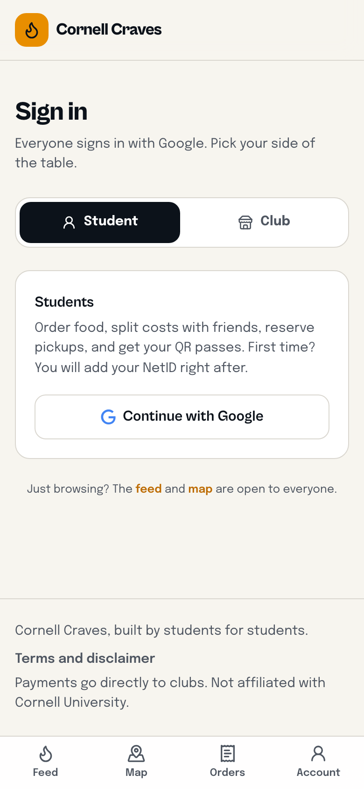 | 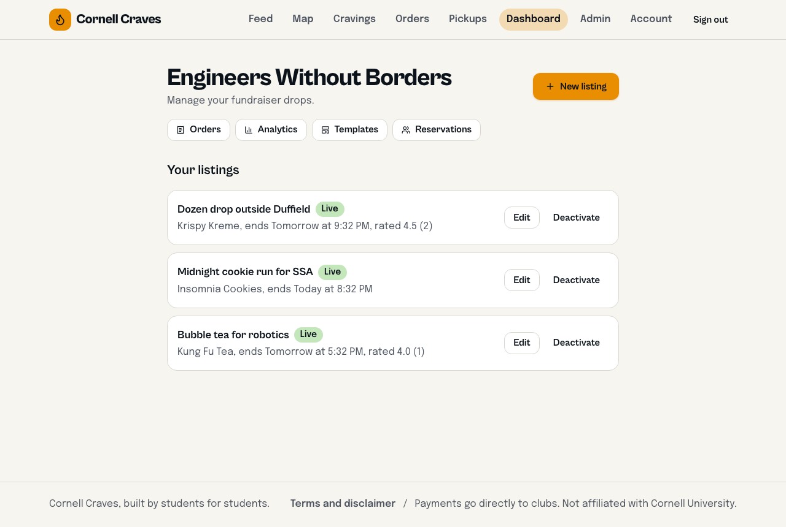 | 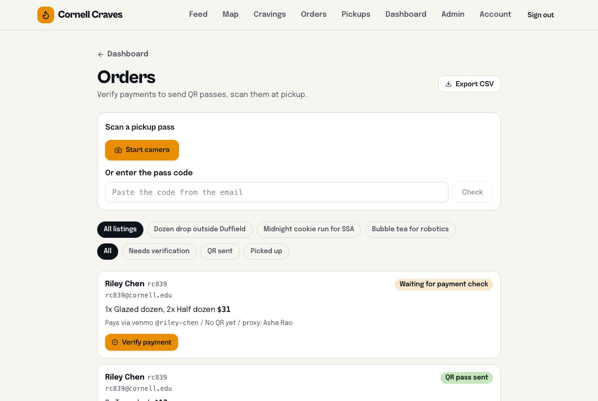 |
| Google-only, portal toggle. | Post and manage drops, jump to tools. | Verify payments, filter, export CSV, scan passes. |

| Analytics | Recurring templates | Reservations manager | Admin |
|---|---|---|---|
| 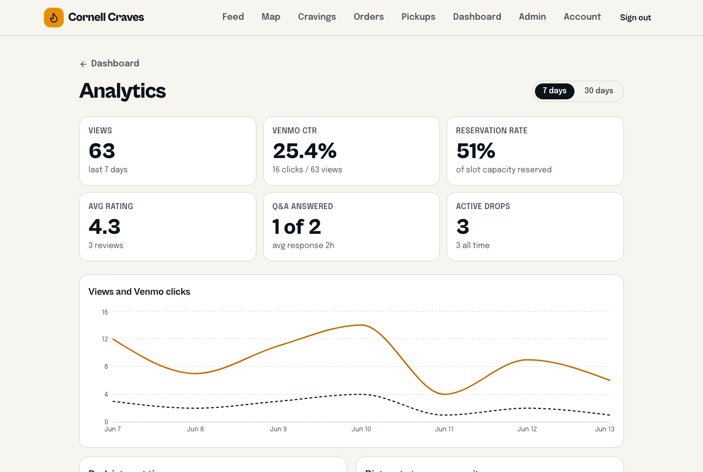 | 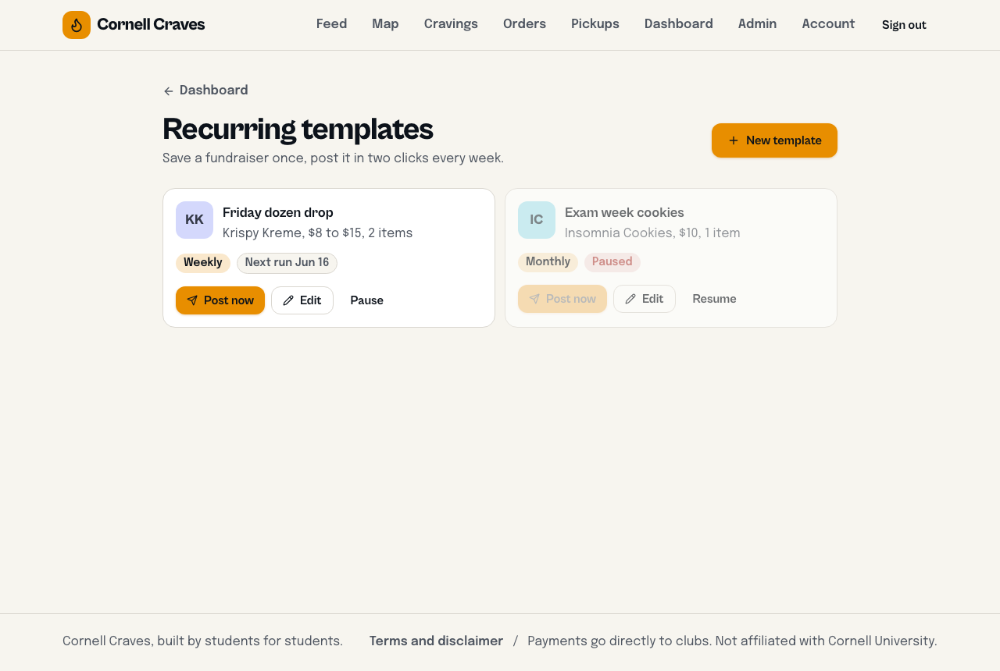 | 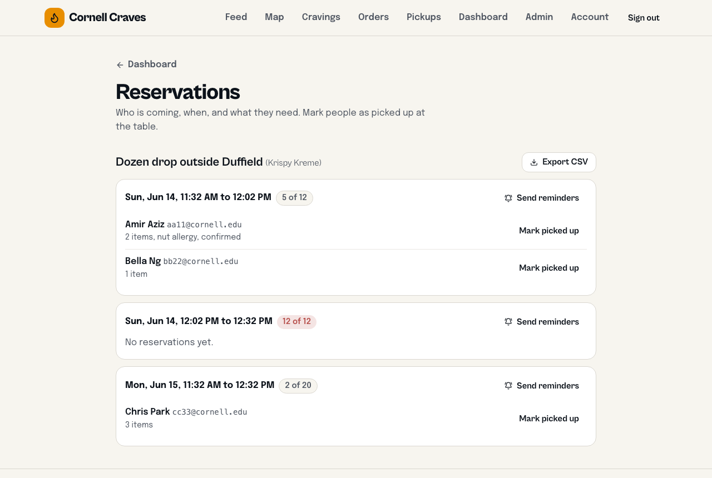 | 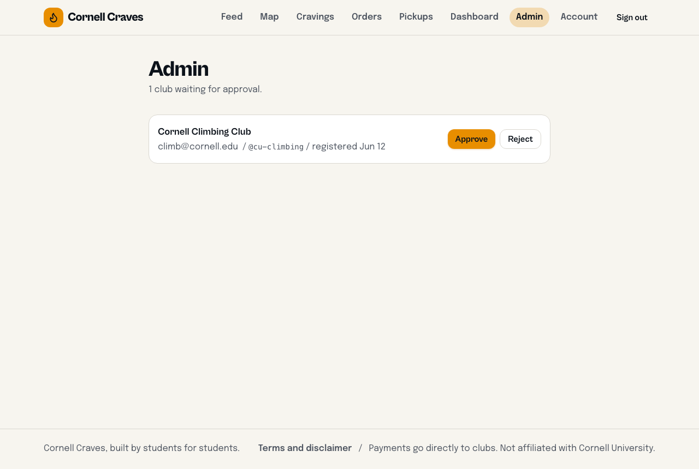 |
| Views, CTR, fill rate, ratings, heatmap. | Save once, repost in two clicks. | Per-slot rosters, mark picked up, reminders. | Approve or reject new clubs. |

> Screenshots are from a local demo with seeded data. Student screens are mobile (the app is mobile-first with a bottom tab bar); club tools are desktop.

---

## Feature checklist

**Discovery (v1)**
- [x] Live feed with debounced brand filter, skeletons, staggered cards, virtualization past 50 items
- [x] Listing pages with Venmo deep links and Zelle copy
- [x] Club registration, admin approval, club dashboard
- [x] Craving brand alerts by email

**Marketplace (v2)**
- [x] Pickup scheduling with capacity-limited slots
- [x] Reviews (immutable, one per person, club responses) and anonymous Q&A
- [x] Campus map (Leaflet + CARTO tiles, custom pins)
- [x] Club analytics (trend, CTR, fill rate, ratings, peak-hours heatmap, dietary mix)
- [x] Recurring fundraiser templates

**Orders + QR pickup (v3)**
- [x] Google sign-in, NetID onboarding, saved payment details
- [x] Order flow with server-authoritative pricing, proxy pickup, review modal
- [x] HMAC-signed QR passes emailed after the club verifies payment
- [x] Club orders dashboard: verify, filter, CSV export, camera QR scanner
- [x] Mobile app shell with bottom tabs, allergen icons

**Order splitting + Google-only auth (v4)**
- [x] Split an item 2 to 4 ways: invite links, email invites, live member status
- [x] 24-hour payment deadlines with color-shifting timers
- [x] Per-member QR passes, auto-cancel past deadline, club reactivation
- [x] Student / Club portal toggle, passwordless club onboarding
- [x] Light-locked theme, refreshed brand list, pickup-type map badges

**Security + production hardening (v4.1)**
- [x] All email-keyed RPCs locked to the authenticated owner (see `SECURITY_AUDIT.md`)
- [x] Orders and reservations require a signed-in Google account
- [x] OWASP security headers + strict CSP (`vercel.json`)
- [x] Terms and liability disclaimer, payments-direct-to-clubs messaging
- [x] Hot-path indexes and caching for high traffic

---

## Tech stack

React 18 + Vite + TypeScript, Tailwind v4 (CSS-first tokens), customized shadcn-style components, Framer Motion, Leaflet + OpenStreetMap, Recharts, qrcode, Supabase (Postgres + Auth + Edge Functions), Resend, Vercel.

## Quick start

```bash
git clone <this repo>
cd cornell-craves
npm install
cp .env.example .env.local   # fill in Supabase URL, anon key, admin email
npm run dev                  # http://localhost:5173
```

Full backend setup (Supabase project, five SQL migrations, Google OAuth, Resend, edge-function secrets, webhooks, cron, security headers, scaling) is a step-by-step checklist in [`NEXT_STEPS.md`](NEXT_STEPS.md). Security details are in [`SECURITY_AUDIT.md`](SECURITY_AUDIT.md), [`SECURITY.md`](SECURITY.md), and [`docs/RLS_POLICIES.md`](docs/RLS_POLICIES.md).

## Project structure

```
src/
  components/   UI primitives, cards, filters, QR view + scanner,
                split-order components, allergen icons, bottom nav
  pages/        Feed, ListingDetail, OrderForm, MyOrders, OrderDetail, InvitePage,
                MapPage, MyReservations, Cravings, Onboarding, Preferences,
                AccountSettings, Login, Register, Terms, Dashboard, ClubOrders,
                ClubAnalytics, ClubTemplates, ClubReservations, Admin
  hooks/        useAuth, useProfile, useClub, useListings, useCountdown, ...
  lib/          supabase, orders, groups, dietary, brands, venmo, analytics, ...
  types/        database.ts (full typed schema + RPC signatures)
supabase/
  migrations/   001_init, 002_marketplace, 003_orders, 004_order_splitting,
                005_security_hardening
  functions/    notify-cravings/ (email + QR signing + scanning + group lifecycle)
```

## Security model (summary)

- RLS on every table; anonymous writes flow through narrow `SECURITY DEFINER` RPCs.
- Order totals and group shares are priced server-side from the listing, never trusted from the client.
- QR passes are HMAC-SHA256 signed server-side (`QR_SECRET`); scans are validated, single-use, and logged.
- Reading your own orders, reservations, and QR passes is bound to your authenticated identity, never a guessable email.
- Q&A asker emails are SHA-256 hashed in the browser before they leave it.

## License

MIT. See [`LICENSE`](LICENSE). Cornell Craves is an independent student project and is not affiliated with Cornell University.
