<div align="center">

# Cornell Craves

### The food you actually crave, brought to campus by clubs, for students.

Built with React, Vite, Tailwind v4, and Supabase. Money goes straight to clubs over Venmo and Zelle. Cornell Craves never touches a cent of it.

**[cornell-craves.pages.dev](https://cornell-craves.pages.dev)** - live demo

</div>

---

## Why it exists

Ithaca is not a food city. The stuff students actually crave (an In-N-Out run, Texas Roadhouse rolls, the bakery drop everyone's posting about) is either not in Ithaca at all, or it's a cross-town trip nobody's making between a 10:10 and an 11:15. So the craving just sits there.

At the same time, the people who could bring that food to campus, student clubs trying to raise money, have no good way to reach hungry students at the exact moment they're hungry.

Cornell Craves connects the two. Clubs run food fundraisers like real storefronts: bring in a sought-after brand, post a drop, take orders, confirm payment, and hand the food over with a scannable pass at pickup. Students get one feed (and a campus map) of every drop happening nearby, set alerts for the brands they want so they hear the second one goes live, order solo or split a box with friends, and get everything by email.

Clubs raise real money. Students finally get the food they wanted without leaving campus.

> Money never flows through the app. Students pay clubs directly over Venmo or Zelle. Cornell Craves is a place to find food and order it, not a payment processor.

---

## For students

Crave it, find it, grab it, all from your phone. Scroll a live feed or a campus map of every drop, follow the brands you love so you get pinged the moment one lands, read real reviews, and order in a few taps. Splitting a 12-box with friends? Start a group, share the link, and everyone gets their own pass.

| Feed | Listing | Reviews |
|---|---|---|
| 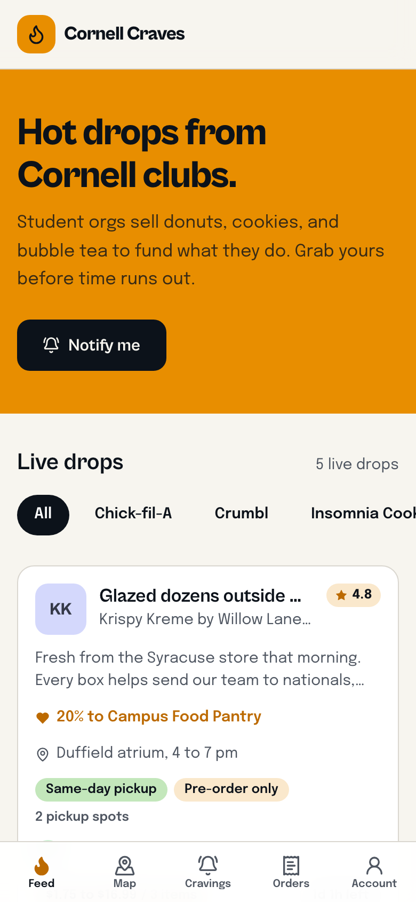 | 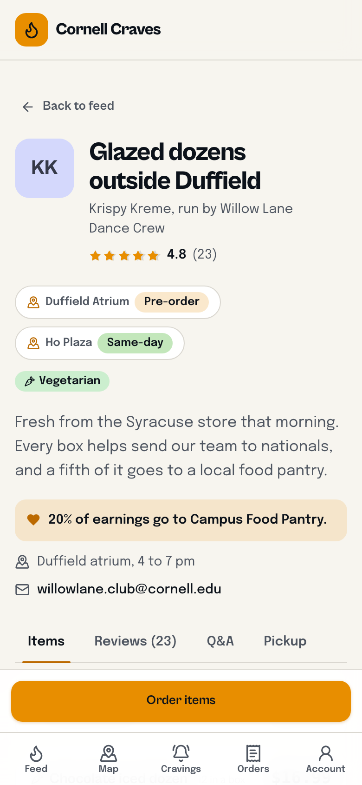 | 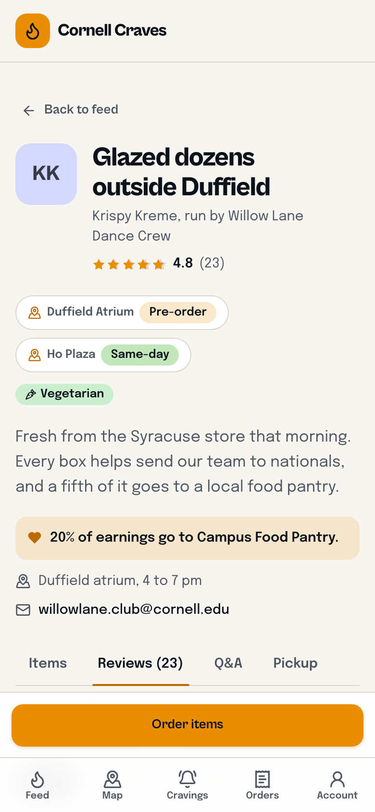 |
| Brand chips, live ratings, dietary icons, countdown badges. | Tabbed Items, Reviews, Q&A, and Pickup with allergen icons. | Star ratings, helpful votes, club replies. |

| Q&A | Pickup scheduling | Order form |
|---|---|---|
| 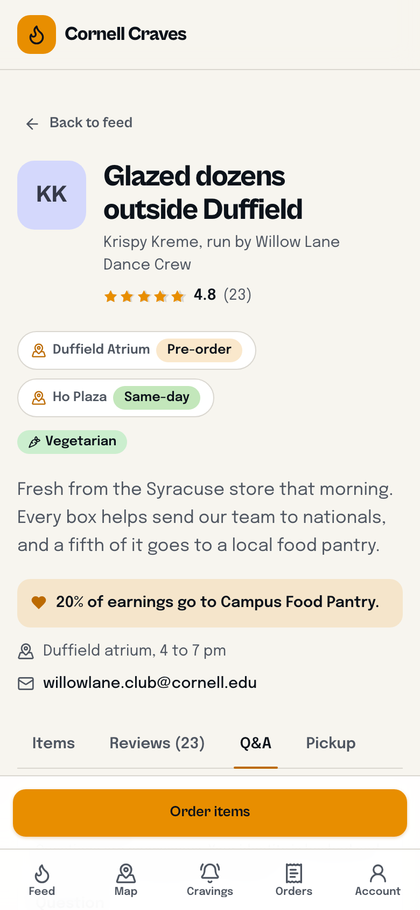 |  | 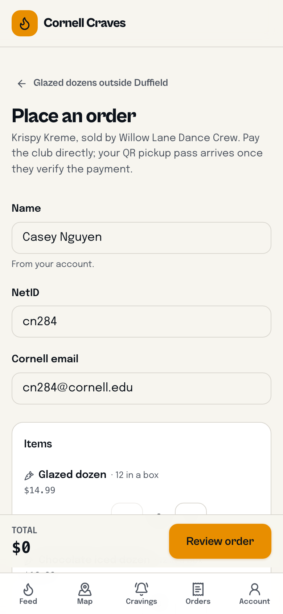 |
| Ask a question, the club answers in public. | Pick a day and time slot, capacity aware. | Quantity steppers, running total, split toggle. |

| My orders and groups | QR pickup passes | Split invite |
|---|---|---|
| 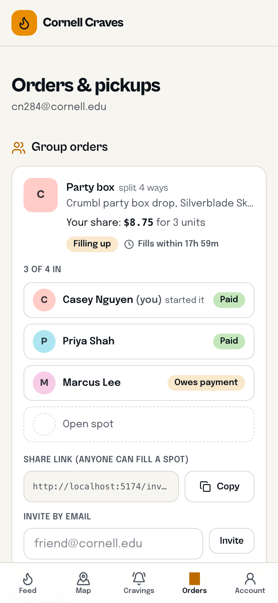 | 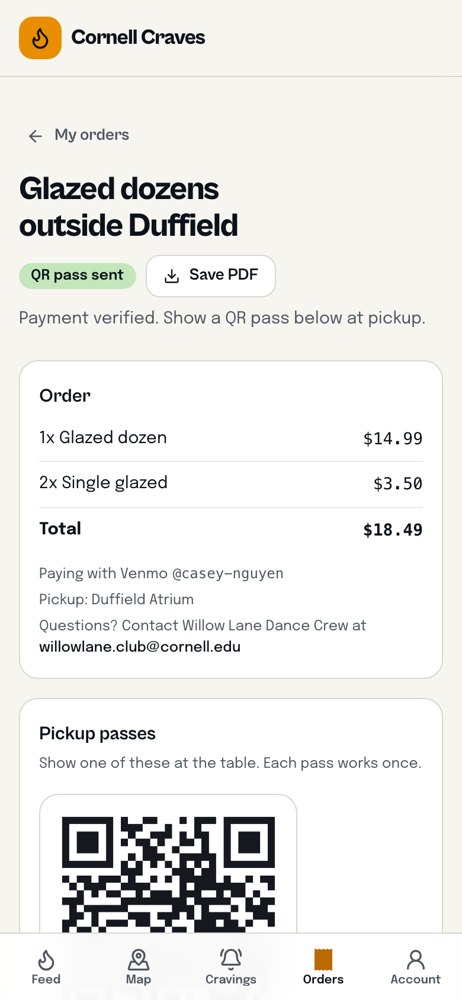 | 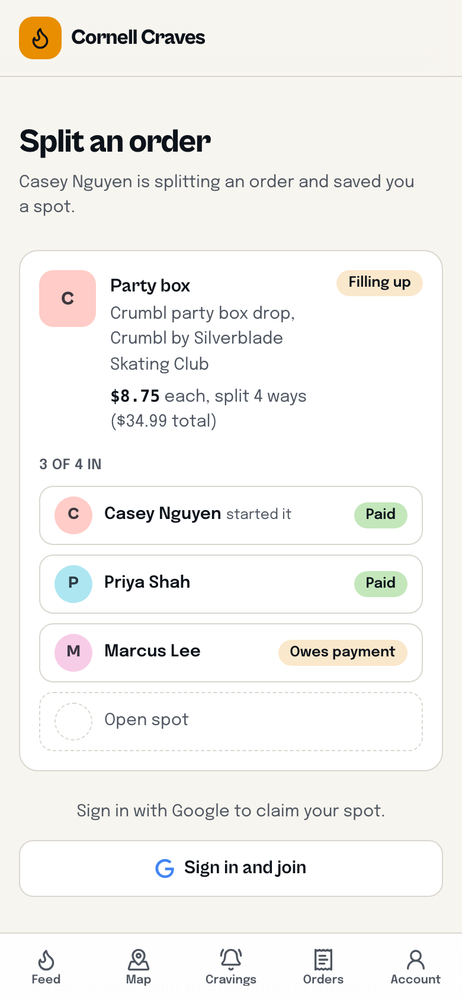 |
| Solo orders, group orders, invites, deadline timers. | Per-person passes plus a 10-character backup code. | Join-link page for split orders. |

| Campus map | My pickups | Account and cravings |
|---|---|---|
| 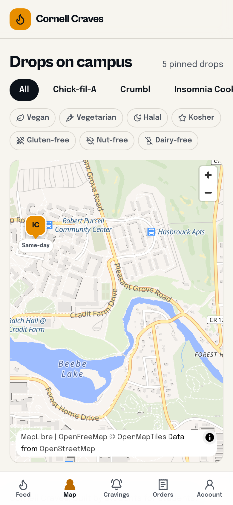 | 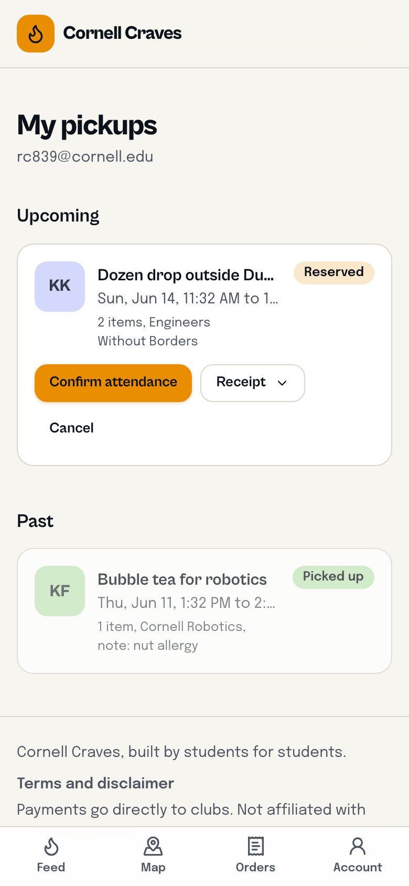 | 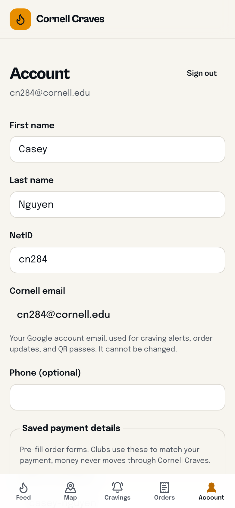 |
| Labeled campus map, pickup-type badges, dietary filters. | Upcoming and past pickups, confirm attendance. | Profile, saved payment handles, brand and dietary prefs. |

## For clubs

Run the fundraiser like a real shop, not a group chat and a spreadsheet. Post a drop, take orders, confirm Venmo or Zelle payments, scan passes at pickup, and see exactly what's selling in your analytics. Save a winning drop as a template and relaunch it in two clicks.

| Sign in (Student or Club) | Club dashboard | Orders and scanner |
|---|---|---|
| 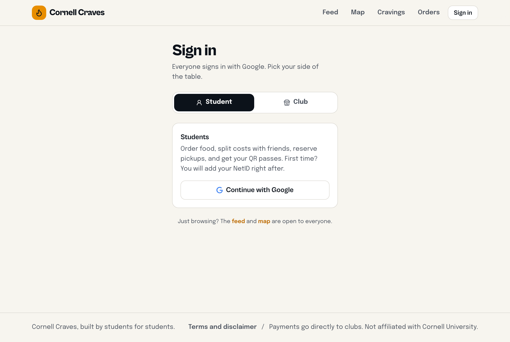 | 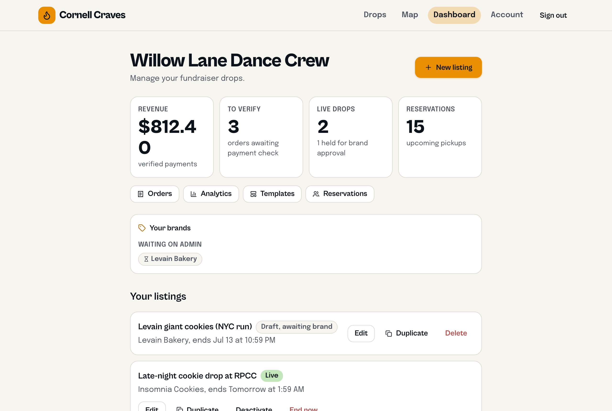 | 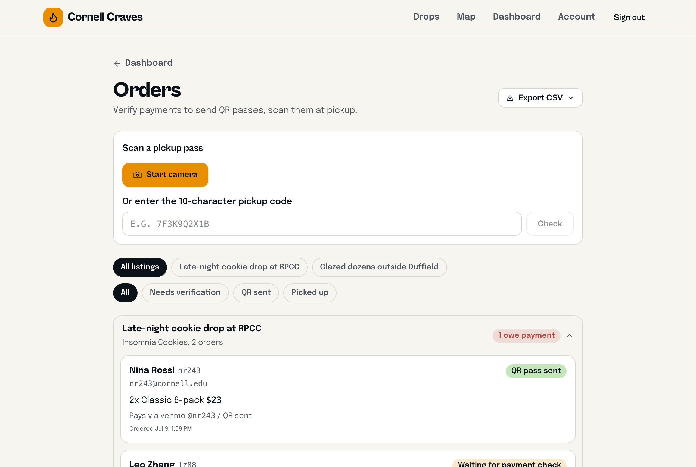 |
| Google sign-in, Student or Club portal. | Post and manage drops, jump to your tools. | Confirm payments, filter, export CSV, scan passes. |

| Analytics | Templates | Pickup manager | Admin |
|---|---|---|---|
| 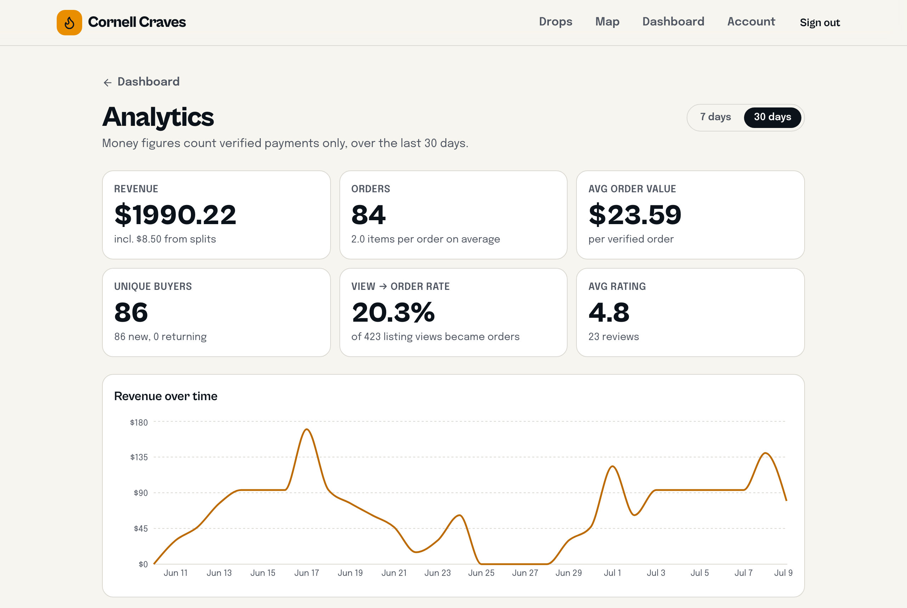 | 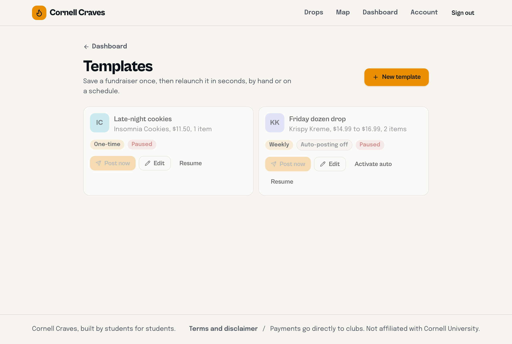 | 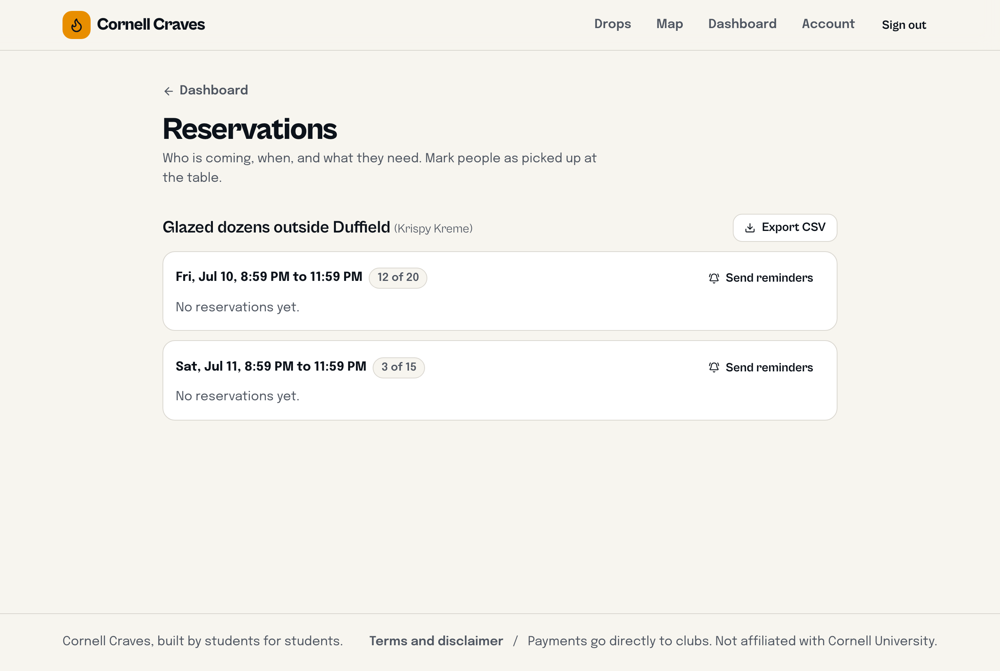 | 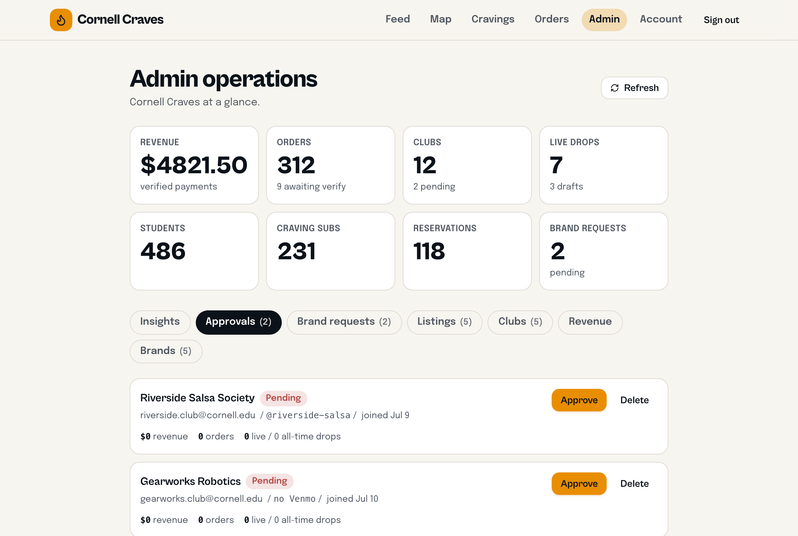 |
| Revenue, units sold, best sellers, peak hours. | Save once, relaunch in two clicks. | Per-slot rosters, mark picked up, send reminders. | Approve or reject new clubs and brands. |

> Screenshots are from a local demo with seeded data. Student screens are mobile-first (bottom tab bar); club tools are built for desktop.

---

## Everything it does

**Learning the app**

- [x] Public **About Cornell Craves** page (`/about`): why it exists, the money rule, every feature split by audience, how data is handled, and an FAQ
- [x] Three interactive simulated walkthroughs (student, club, admin) that run on invented sample data — no real drop, order, club, or payment is ever touched
- [x] Offered once automatically on a first sign-up, replayable forever from `/about`, the club dashboard, the admin console, and account settings
- [x] Skippable at every step (footer, close button, Escape, backdrop), and never blocked on completing an interaction

**Discovery and alerts**

- [x] Live feed with brand filtering, skeletons, staggered cards, and virtualization past 50 items
- [x] Listing pages with Venmo deep links and Zelle copy-to-clipboard
- [x] Club registration, admin approval, and a full club dashboard
- [x] Craving alerts by email, so students hear about a brand the second it drops

**Marketplace and scheduling**

- [x] Pickup scheduling with capacity-limited time slots
- [x] Reviews (one per person, immutable, with club replies) and public Q&A
- [x] Labeled campus map with per-location pins and dietary filtering
- [x] Club analytics: revenue, units sold, best and worst sellers, peak-order heatmap, dietary mix
- [x] Reusable fundraiser templates

**Orders and QR pickup**

- [x] Google sign-in, NetID onboarding, saved payment details
- [x] Order flow with server-priced totals, proxy pickup, and a review step
- [x] HMAC-signed QR passes emailed once the club confirms payment, plus a 10-character backup code
- [x] Club orders dashboard grouped by listing: confirm, filter, export CSV, and a camera scanner that works on Safari
- [x] Mobile app shell with bottom tabs and allergen icons

**Order splitting**

- [x] Split a box across friends, with invite links, email invites, and live member status
- [x] Private and public groups, with solo students auto-matched into open public groups
- [x] 24-hour payment windows with color-shifting timers
- [x] Per-member passes, auto-cancel past the deadline, and club reactivation

**Security and hardening**

- [x] Every personal-data lookup locked to the signed-in owner (see `SECURITY_AUDIT.md`)
- [x] Orders and pickups require a signed-in Google account
- [x] OWASP security headers and a strict CSP (`public/_headers` for Cloudflare, `vercel.json` for Vercel)
- [x] Terms and liability disclaimer, with money-goes-to-clubs messaging throughout
- [x] Hot-path indexes and caching for event-day traffic

---

## Getting started - Students

### 1. Create your account

1. Go to the app and tap **Sign in**.
2. On the login screen, make sure the **Student** tab is selected.
3. Tap **Continue with Google** and sign in with your Cornell Google account (`@cornell.edu`).
4. You'll land on the **Onboarding** screen. Enter your Cornell NetID (e.g. `ab123`) and tap **Save**.

That's it - you're in. You won't need to do this again.

---

### 2. Set up your profile and preferences

Before your first order, fill in a few optional-but-useful things:

1. Tap the **Account** tab (bottom right on mobile).
2. Under **Payment handles**, add your Venmo username and/or Zelle phone number. Clubs will use these to confirm you've paid - saves you typing it every order.
3. Tap **Dietary preferences** and toggle on any filters that apply (vegan, gluten-free, nut-free, etc.). These are saved to your account and pre-applied whenever you browse.
4. Tap **Brand alerts** (or go to **Cravings** in the bottom nav) to subscribe to specific brands. You'll get an email the moment a club posts a drop for that brand.

---

### 3. Browse drops

**Feed (Home tab)**

The home feed shows every active drop on campus, newest first. Drops automatically disappear when they expire.

- **Filter by brand** - tap any chip along the top (Krispy Kreme, Insomnia Cookies, Kung Fu Tea, etc.) to narrow the feed. Tap again to clear.
- **Dietary icons** - each card shows allergen and dietary badges so you can spot what's safe at a glance.
- **Countdown badge** - a timer on each card shows how long the drop is live. When it hits zero, ordering closes.
- **Ratings** - the star rating and review count are live averages from past orders.

**Map tab**

Tap the map icon in the bottom nav to see a labeled campus map with a pin for every active pickup location.

- Tap a pin to see which drops are picking up there and what dietary options are available.
- Use the filter panel to show only drops matching your dietary preferences.
- If you lose your connection, the map falls back to the last-known feed.

---

### 4. Read a listing

Tap any card to open the full listing. It has four tabs:

| Tab | What's there |
|---|---|
| **Items** | Every item, price, allergen icons, and a description |
| **Reviews** | Star ratings and written reviews from past orders, with club replies |
| **Q&A** | Public questions and club answers - ask anything about the drop |
| **Pickup** | Pickup location(s), type (walk-up, table, delivery), and available time slots |

Tap **Ask a question** on the Q&A tab to submit a question. The club answers publicly so everyone benefits.

---

### 5. Place a solo order

1. On a listing, tap **Order**.
2. Use the **+** and **−** steppers to pick quantities. A running total updates as you go.
3. Enter your **Venmo username** or **Zelle phone number** (pre-filled if you saved them in Account settings).
4. Pick a **pickup time slot** - slots show how many spots are left and close when full.
5. Tap **Review order** to see a summary, then **Place order**.

You'll receive a confirmation email. Your order appears under **My Orders** (bottom nav).

> **Payment note:** Cornell Craves never handles money. After placing your order, pay the club directly over Venmo or Zelle. The club will confirm your payment and then email your QR pickup pass.

---

### 6. Place a split order

Split orders let a group of friends share one large box, each paying their own share.

1. On a listing, tap **Order**, then toggle **Split this order** at the top.
2. Choose your item and set the **number of people** splitting with you.
3. Tap **Start split order** - you'll get a shareable invite link.
4. Share the link with your group. Each person opens it, signs in, and joins.
5. Once the group is full, everyone gets an email unlocking payment. You each have **24 hours** to pay the club your share.
6. The club confirms each payment individually. Each person gets their own QR pickup pass.

**Deadline timer colors:**
- Normal - more than 6 hours left
- Orange - under 6 hours
- Red - under 2 hours

If a member doesn't pay in time, their slot is released and the club is notified.

---

### 7. Pick up your order

Once the club confirms your payment:

1. You'll get an email with your **QR pickup pass** attached.
2. Open **My Orders** in the app, find your order, and tap it to view the pass on-screen.
3. At pickup, show the QR code. The club scans it and marks you as picked up.
4. If you can't load the QR, give the club your **10-character backup code** shown below the QR - it works the same way.

Each pass is single-use. Once scanned, it's marked as used.

---

### 8. Leave a review

After pickup, you can leave a review on the listing.

1. Go to the listing page and open the **Reviews** tab.
2. Tap **Write a review**, pick a star rating, and add a comment.
3. Reviews are **one per person per listing** and can't be edited after submission - so be honest.

Clubs can reply to your review publicly.

---

### 9. Manage your cravings (brand alerts)

1. Tap **Cravings** in the bottom nav.
2. Tap the bell next to any brand to subscribe. You'll get an email the moment a club posts a drop for that brand.
3. Tap again to unsubscribe.

---

### 10. View past and upcoming pickups

Tap **My Pickups** (accessible from the Account tab or bottom nav) to see:

- **Upcoming** - pickups you're confirmed for, with time and location
- **Past** - history of pickups you've attended

Tap any entry to see the order details and your QR pass.

---

## Getting started - Clubs

### 1. Register your club

1. Go to the app and tap **Sign in**.
2. On the login screen, select the **Club** tab.
3. Tap **Continue with Google** and sign in with the Google account your club will use.
4. You'll be sent to the **Club Registration** form. Fill in:
   - Club name
   - A short description
   - Contact email
   - Venmo and/or Zelle handle (where students will pay you)
5. Submit. Your registration goes to the Cornell Craves admin for approval.
6. Once approved, you'll receive a **welcome email** and your Club Dashboard will be unlocked.

---

### 2. Post a drop (the Dashboard)

The Dashboard is your main hub. From here you can post new drops, edit existing ones, and jump to any of your tools.

**To create a new drop:**

1. On the Dashboard, tap **New drop** (the + button).
2. Fill in the listing form:
   - **Brand** - select from the approved list or choose "Other"
   - **Title** - e.g. "Insomnia Cookies - Finals Week Drop"
   - **Description** - tell students what's included, minimum order, any limits
   - **Items** - add each item with a name, price, and optional description and allergen tags
   - **Order deadline** - the date and time when ordering closes
   - **Pickup type** - Walk-up, Table, or Delivery
   - **Pickup location** - select a campus location from the map or enter a custom address
   - **Time slots** - add one or more pickup windows with a start time, end time, and capacity (max students per slot)
3. Tap **Post drop**. It goes live immediately on the student feed.

**To edit or take down a drop:**

Find the listing on your Dashboard, tap the three-dot menu, and choose **Edit** or **Remove**. Removing a drop that has existing orders will notify affected students.

---

### 3. Manage orders

Tap **Orders** from the Dashboard (or the orders icon) to reach your orders view.

**Order list features:**

- Orders are grouped by listing. Tap a listing header to expand/collapse its orders.
- Each order shows student name, items, total, payment handle, and current status.
- **Filter** orders by status: All, Pending payment, Paid, Picked up, Canceled.
- **Search** by student name or NetID.
- **Export CSV** - download the full order list for any listing for your own records.

**To confirm a payment:**

1. Find the order (filter by "Pending payment" to focus).
2. Verify the student paid you on Venmo or Zelle using the handle shown.
3. Tap **Verify payment**. This immediately emails the student their QR pickup pass.

---

### 4. Scan QR passes at pickup

At your pickup event, use the built-in scanner to check students in without manual lookups.

1. From the Dashboard or Orders view, tap **Scan passes**.
2. Allow camera access when prompted.
3. Point the camera at a student's QR code. The scanner works on Safari and Chrome on iOS.
4. A green confirmation means the pass is valid and the student is marked as picked up.
5. A red error means the pass was already used or is invalid - check the backup code manually if needed.
6. If a student shows you a **10-character backup code** instead, tap **Enter code** and type it in.

---

### 5. Manage pickup slots (Reservations)

Tap **Reservations** (or **Pickup manager**) from the Dashboard to see a slot-by-slot view of who's coming when.

- **Per-slot rosters** - see every student booked for each time slot with their order details.
- **Mark picked up** - tap a student's name to mark them as picked up from this view (alternative to scanning).
- **Send reminder** - tap **Remind** on a slot to email all students booked for it with the pickup time and location.
- Use this view before each pickup to know your crowd size per slot and confirm attendance.

---

### 6. Analytics

Tap **Analytics** from the Dashboard to see performance data for all your drops.

| Section | What it shows |
|---|---|
| **Revenue** | Total earned per listing and across all drops |
| **Units sold** | Item-by-item breakdown of quantities sold |
| **Best sellers** | Top items by revenue and by units |
| **Peak order times** | Hour-by-hour heatmap of when orders come in |
| **Dietary mix** | Breakdown of dietary preferences across your orders |

Use analytics to decide which brands to run again, what items to price higher or cut, and when to post new drops for maximum visibility.

---

### 7. Templates

Templates let you save a winning drop and relaunch it in two clicks - no re-entering items, slots, or descriptions.

**To save a template:**

1. Go to the listing you want to save.
2. Tap the three-dot menu and choose **Save as template**.
3. Give the template a name (e.g. "Insomnia Finals Drop").

**To launch from a template:**

1. Tap **Templates** from the Dashboard.
2. Find the template and tap **Use template**.
3. The new drop form pre-fills with all the saved items and settings. Update the order deadline and pickup slots, then post.

Templates are private to your club.

---

### 8. Reply to reviews and Q&A

Students can leave reviews and ask questions on your listings. Engaging with them builds trust.

**Reviews (Listings → Reviews tab):**
- Tap **Reply** under any review to post a public response.
- Replies are visible to all students browsing the listing.

**Q&A (Listings → Q&A tab):**
- Unanswered questions show a badge on your Dashboard.
- Tap a question and tap **Answer** to post a public reply.
- Questions with answers help future students and reduce repeat questions.

---

## Tech stack

React 18, Vite, and TypeScript. Tailwind v4 with CSS-first tokens, customized shadcn-style components, and Framer Motion. MapLibre GL on a labeled OpenStreetMap basemap, Recharts, and qrcode. Supabase for Postgres, Auth, and Edge Functions. Brevo for email. Hosted on Cloudflare Pages.

## Quick start

```bash
git clone <this repo>
cd cornell-craves
npm install
cp .env.example .env.local   # fill in Supabase URL, anon key, admin email
npm run dev                  # http://localhost:5173
```

Full backend setup (Supabase project, SQL migrations, Google OAuth, Brevo, edge-function secrets, webhooks, cron, security headers, scaling) is a step-by-step checklist in `NEXT_STEPS.md`. Security details live in [`SECURITY_AUDIT.md`](SECURITY_AUDIT.md), [`SECURITY.md`](SECURITY.md), and [`docs/RLS_POLICIES.md`](docs/RLS_POLICIES.md).

## Project structure

```
src/
  components/   UI primitives, cards, filters, QR view and scanner,
                split-order components, allergen icons, bottom nav
  components/
    tour/       walkthrough shell, sandbox primitives, and the three step
                scripts (student, club, admin), lazily loaded as one chunk
  pages/        Feed, ListingDetail, OrderForm, MyOrders, OrderDetail, InvitePage,
                MapPage, MyReservations, Cravings, Onboarding, Preferences,
                AccountSettings, Login, Register, Terms, About, Dashboard,
                ClubOrders, ClubAnalytics, ClubTemplates, ClubReservations, Admin
  hooks/        useAuth, useProfile, useClub, useListings, useCountdown, and more
  lib/          supabase, orders, groups, dietary, brands, analytics, geocode, and more
  types/        database.ts (full typed schema plus RPC signatures)
supabase/
  migrations/   numbered SQL migrations, applied in order
  functions/    notify-cravings (email, QR signing, scanning, group lifecycle)
```

## Security model (summary)

- RLS on every table. Anonymous writes flow only through narrow `SECURITY DEFINER` RPCs.
- Order totals and group shares are priced server-side from the listing, never trusted from the client.
- QR passes are HMAC-SHA256 signed server-side with `QR_SECRET`. Scans are validated, single-use, and logged.
- Reading your own orders, pickups, and passes is bound to your signed-in identity, never a guessable email.
- Q&A asker emails are SHA-256 hashed in the browser before they ever leave it.

## License

MIT. See [`LICENSE`](LICENSE). Cornell Craves is an independent student project and is not affiliated with Cornell University.
